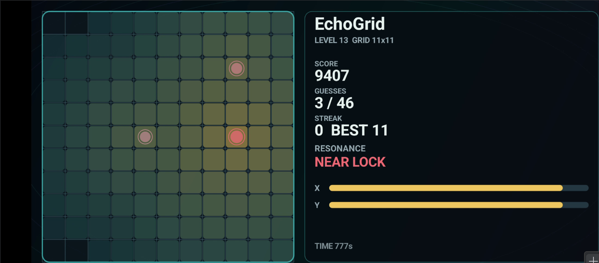

# EchoGrid



EchoGrid is an Android game about finding a hidden target by listening. Each tap probes a tile on the grid, and the game answers with a short two-tone echo that tells you how close that probe was on each axis. The visual board gives a readable heat trail, but the core skill is learning to navigate by sound.

## Gameplay

The goal is hidden somewhere on the grid. Tap a tile to send out a scan. EchoGrid responds with:

- a marker on the tile you touched
- a colored pulse and heatmap feedback around previous probes
- a short train of tones for the X and Y axes
- haptic feedback that strengthens as you get closer
- score, streak, guess count, and level progress

When you hit the target tile, the core reveals, the score is awarded, and the next round begins. Early rounds are intentionally forgiving: the first test starts on a small, easy grid so players can learn what the sounds mean before the game asks for precision.

## How The Echo Works

Each scan has two tones:

1. The first tone represents X-axis proximity.
2. The second tone represents Y-axis proximity.

The closer your probe is to the hidden goal on an axis, the higher that axis tone becomes. A far X guess produces a low first tone; a close X guess produces a high first tone. The same rule applies independently to the second, Y-axis tone.

Overall distance also affects timing and feel. Close probes have a tighter gap between tones and stronger haptic feedback. Far probes have a wider tone separation and softer feedback. This makes the audio readable in two ways: pitch tells you axis closeness, while rhythm and vibration tell you overall confidence.

Keeping X and Y as separate tone trains is deliberate. It trains a natural echo-location skill: players learn to split a single tap into two spatial clues, then combine those clues into a mental map of the target.

## Difficulty Curve

EchoGrid currently starts simple on purpose. The first rounds are tuned to be easy, with a small grid and strong feedback. As levels advance, the grid grows and the target takes more careful listening to locate.

The next layer of progression should make the sound field more interesting, not just larger. Good additions include:

- adding more tiles as levels increase
- reducing echo strength near the target in harder rounds
- introducing walls or sonic barriers that bend, block, or dampen echoes
- adding decoy reflections that require comparing multiple probes
- using materials with different sonic behavior, such as soft, metallic, or hollow tiles

That progression keeps the first test approachable while leaving room for a more robust game: simple at the start, then deeper as the player builds a real ear for the grid.

## Build

EchoGrid is Android standard build.

```bash
./gradlew :app:assembleDebug
```

The debug APK is generated at:

```text
app/build/outputs/apk/debug/app-debug.apk
```

Tagged releases automatically build an APK and publish it to GitHub Releases.

## Project Shape

- `app/src/main/java/com/aniviza/echogrid/MainActivity.java` starts the fullscreen game.
- `app/src/main/java/com/aniviza/echogrid/EchoGridView.java` contains rendering, gameplay, generated audio cues, haptics, scoring, and level progression.
- `docs/images/echogrid-banner.png` is the README banner screenshot.
